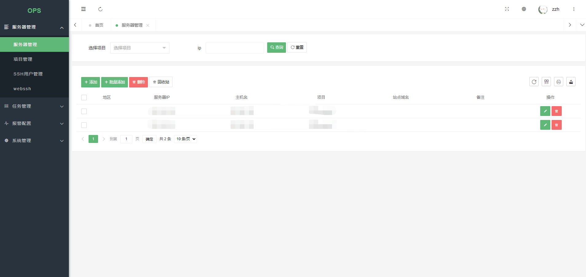

> 半成品，很多功能还未实现
# 项目简介
运维管理系统

# 功能
- [x] 用户管理：用户是系统操作者，该功能主要完成系统用户配置。
- [x] 权限管理：配置系统菜单，操作权限，按钮权限标识等。
- [x] 角色管理：角色菜单权限分配。
- [x] 服务器管理：服务器列表。
- [x] 项目管理：项目管理。
- [x] ssh用户管理：连接ssh的用户。
- [x] webssh: ssh连接。
# 待实现
- [ ] sftp: 上传下载文件，待完成。
- [ ] 服务器权限管理：针对单台服务器授权，待完成。
- [ ] 任务管理: 环境部署、ansible-playbook、shell/python命令执行，待完成。
- [ ] 监控配置：在另外一套系统，还未迁移过来，待完成。
- [ ] 报警管理： 前端页面还未修改，另外由于监控属于另外一套系统，同步到这个系统后再做更新。
- [ ] 收件人管理: 同上。
- [ ] 报警邮寄历史：同上。
- [ ] 配置管理：线上各个服务的配置管理，待完成。
- [ ] 代码更新： 集成jenkins，待完成。
- [ ] 系统日志：待完成。

# 部署
环境要求：

| 类型| 版本|
| :--- |:--- |
| OS | linux |
| python | >=3.6 |
| mysql | >=5.6 |
| redis | >=5.0 |

mysql安装：略  
redis安装：略  
python安装：略

项目下载：
```bash
git clone https://gitee.com/Rabbit/Rabbit
```
python依赖模块安装：
```bash
pip3 install -r requirement.txt
```
修改配置：
```bash
$ vim .env
# mysql
DB_HOST='127.0.0.1'
DB_PORT=3306
DB_USER='us_flask'
DB_PASSWORD='111222333'
DB_DATABASE='rabbit'
DB_CHARSET='utf8mb4'

# system
SYSTEM_NAME='Rabbit'
SECRET_KEY='1111111222223333aaaaaa'
AUTH_SALT='qwertyuiop@Q1'

# redis
REDIS_URL='redis://127.0.0.1:6379/0'
CELERY_BROKER_URL='redis://127.0.0.1:6379/1'
CELERY_RESULT_BACKEND='redis://127.0.0.1:6379/1'
```
创建数据库：
```sql
create database rabbit DEFAULT CHARACTER SET utf8mb4;
```
创建表：
```bash
flask db init
flask db migrate -m 'init'
flask db upgrade
```
导入初始化数据：
```bash
mysql -uroot -p rabbit < init.sql
```
安装supervisor
```bash
$ yum -y install supervisor
$ vim /etc/supervisord.conf
...
...
[include]
files = supervisord.d/*.conf    # 这里改成.conf
$ vim /etc/supervisord.d/rabbit.conf 
[program:rabbit]
# 请自行改为对应的python路径
command=/data/flask/ops/venv/bin/python3 rabbit.py
# 项目存放路径
directory=/data/flask/ops/
user=root
autostart=true
autorestart=true
stopasgroup=true
killasgroup=true
stdout_logfile = /data/flask/ops/logs/supervisord.log
# 启动
$ systemctl enable supervisord
$ systemctl start supervisord
# 查看启动状态
$ supervisorctl status
rabbit                                       RUNNING   pid 11472, uptime 0:00:11
```
nginx安装(非必须)：
```bash
# centos7
$ yum -y install epel-release
$ yum -y install nginx 
$ vim /etc/nginx/conf.d/rabbit.conf
server {
    listen 80;
    server_name rabbit;
    charset utf8;
    gzip_min_length 1024;

    access_log /var/log/nginx/rabbit_access.log main;
    error_log /var/log/nginx/rabbit_error.log;

    location / {
        proxy_pass http://127.0.0.1:8888;
        proxy_redirect default;

        proxy_set_header Connection "";
        proxy_set_header Host $host;
        proxy_set_header X-Real-IP $remote_addr;
        proxy_set_header X-Forwarded-For $proxy_add_x_forwarded_for;
        proxy_set_header X-Forwarded-Proto $scheme;

        proxy_connect_timeout      90;
        proxy_send_timeout         180;
        proxy_read_timeout         180; 

        proxy_buffer_size 128k;
        proxy_buffers 4 256k;
        proxy_busy_buffers_size 256k;
        proxy_temp_file_write_size 256k;
    }
}
$ nginx -t
$ systemctl start nginx
```
访问：
```
http://127.0.0.1:8888
# 如果部署了nginx，直接访问http://127.0.0.1
```
默认账号密码:
```sql
admin
Password@123A
```
# 项目预览
